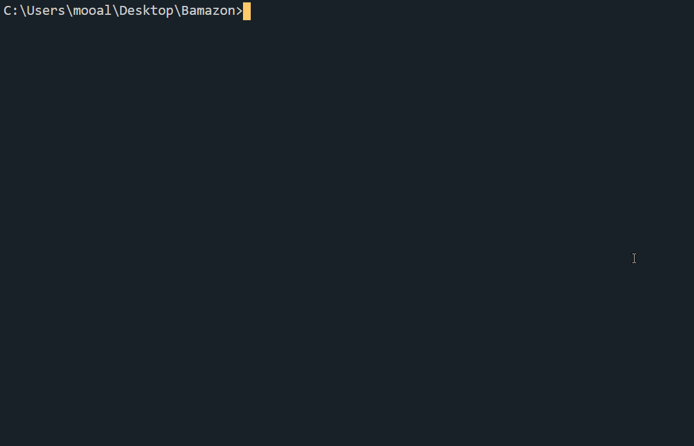

## Bamazon
Amazon-like storefront that utilizes Node.js & MySQL. This app will take in orders from customers and deplete stock from the store's inventory and also it will prompt special requests.

## Getting Started:
Download the "images" folder to visualize each command.
This will allow you to better see how Bamazon works with each given command.

## Actions:
Running this application (bamazon.js) will first display all of the items available for sale, This includes the Item IDs, Product Names, Prices, Departments and the available Stock of products for sale.
This app will then prompt the users with two messages.
The first prompt should ask them the ID of the product they would like to buy.
The second prompt should ask how many UNITS of the product they would like to purchase.
Once the customer has placed the order, your application should check if your store has enough of the product to meet the customer's request. If not, the app will log a phrase like “Our Apologies, We Only Have “*“ Left In Stock!.”

## DEMO:

## Technologies & Concepts Used:

* MySQL
* Javascript
* Node.js
* NPM Packages
1. npm init (https://www.npmjs.com/package/init)
2. npm i mysql (https://www.npmjs.com/package/mysql)
3. npm i inquirer (https://www.npmjs.com/package/inquirer)
4. npm i cli-table3 (https://www.npmjs.com/package/cli-table3)
5. npm i chalk (https://www.npmjs.com/package/chalk)
* Object-Oriented Design
* Asynchronous Programming

# Bamazon - Made by Muhammad Ali.